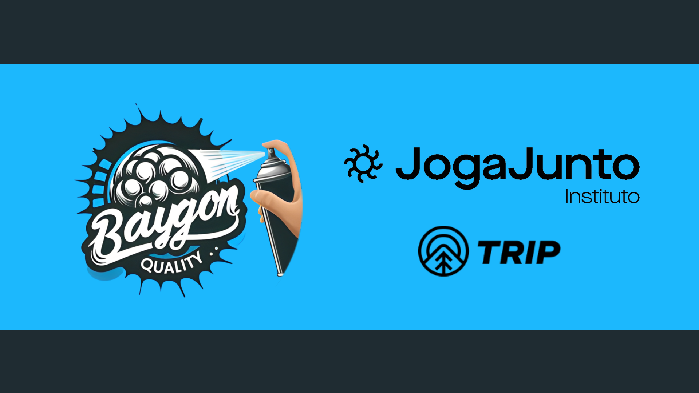

# baygon_inventory





> Este é a última avaliação do Instituto Joga Junto do módulo Avançado, onde este repositório é apenas um dos artefados usados para a entrega final.

##  Sobre o Projeto

Esse  projeto automatiza testes para o sistema de controle de estoque do Instituto Joga Junto, usando Selenium, Behave e um ambiente virtual utilizando a linguagem Python.


## Tecnologias Utilizadas

- **Selenium**: Automação do navegador e interação com a interface web.
- **Behave**: Testes de aceitação com Gherkin.
- **Ambiente Virtual Python**: Isolamento das dependências do projeto.

## Funcionalidades Testadas

- **Login/Logout**: Verifica a funcionalidade de login e logout.
- **Cadastro de Produto**: Testa o processo de adição de novos produtos.
- **Pesquisa de Produto**: Valida a funcionalidade de busca.
- **Filtragem de Produtos**: Verifica a capacidade de filtrar produtos.

## Configuração do Ambiente

1. **Criação do Ambiente Virtual**

    ```sh
    python -m venv venv
    ```

2. **Ativação do Ambiente Virtual**

    - No Windows:

        ```sh
        venv\Scripts\activate
        ```

    - No Linux/Mac:

        ```sh
        source venv/bin/activate
        ```

3. **Instalação das Dependências**

    ```sh
    pip install -r requirements.txt
    ```

## Dependências

Veja o arquivo `requirements.txt` para as bibliotecas necessárias.

### Principais Imports

```python
from behave import given, when, then
from selenium.webdriver.common.by import By
from selenium.webdriver.support.ui import WebDriverWait
from selenium.webdriver.support import expected_conditions as EC
import time
```

## 🤝 Squad Baygon

Agradecemos imensamente as pessoas que fizeram esse projeto acontecer: o nosso querido **Squad Baygon Quality** e ao Instituto Joga Junto pela oportunidade.

<table>
  <tr>
    <td align="center">
      <a href="https://github.com/anniellecrispim" title="GitHub da Annielle">
        <br>
        <sub>
          <b>Annielle Crispim</b>
        </sub>
      </a>
    </td>
    <td align="center">
      <a href="https://github.com/caiobarreto0" title="GitHub do Caio">
        <br>
        <sub>
          <b>Caio Barreto</b>
        </sub>
      </a>
    </td>
     <td align="center">
      <a href="https://github.com/juliarobaina" title="GitHub da Julia">
        <br>
        <sub>
          <b>Julia Robaina</b>
        </sub>
      </a>
    </td>
    <td align="center">
      <a href="https://github.com/Vitor-Back" title="GitHub do Vitor">
        <br>
        <sub>
          <b>Vitor Back</b>
        </sub>
      </a>
    </td>
    <td align="center">
      <a href="https://github.com/tamiresana" title="GitHub da Tamires">
        <br>
        <sub>
          <b>Tamires Ana</b>
        </sub>
      </a>
    </td>
  </tr>
</table>

## 😄 Sobre o Instituto 

O Instituto Joga Junto é uma organização que promove oportunidades de desenvolvimento por meio da educação e formação profissional. Eles oferecem tutoria gratuita no modo 'estudo aberto', com turmas selecionadas e pequenas,  focando no treinamento em áreas de tecnologia, com o objetivo de capacitar pessoas e abrir novas perspectivas de carreira. O Instituto também se dedica a projetos sociais que buscam transformar vidas através do conhecimento e da inclusão social. E o mais importante: **Jogar Junto!**

### Trilha Tripp 

Além de estamos na trilha de capacitação de QA (Quality Assurance), estamos no módulo avançado com direito a treinameto com Python e testes automatizados. Além de testes de API.

### Avaliadores Projeto final

Nossos avaliadores do Projeto Final

<table>
  <tr>
    <td align="center">
      <a href="https://github.com/MatheusGeambastiane" title="Foto do Matheus">
        <br>
        <sub>
          <b>Matheus Geambastiane</b>
        </sub>
      </a>
    </td>
 <td align="center">
      <a href="https://www.linkedin.com/in/rfdsouza/" title="Perfil do Trem Desgovernado no LinkedIn">
      <br>
     <sub>
       <b>Renato Souza</b>
     </sub>
   </a>
 </td>
  <td align="center">
      <a href="" title="">
        <br>
        <sub>
          <b>Edson</b>
        </sub>
      </a>
    </td>
<table>
